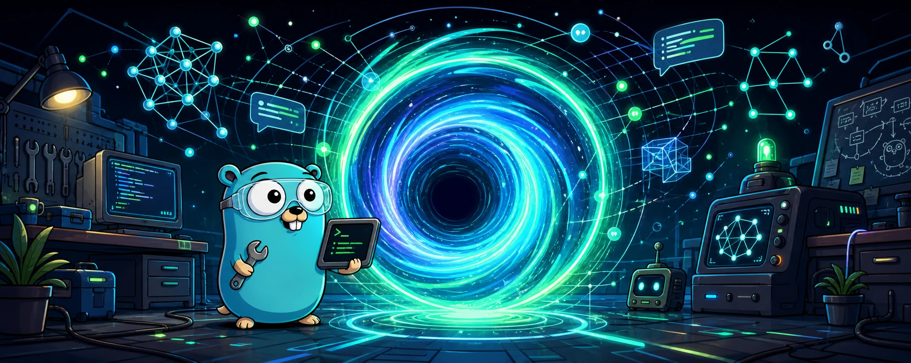

# Wormhole

<p align="center">
  
</p>

A portal-grade Go SDK for LLM apps that would prefer not to learn six provider
dialects before lunch.

OpenAI lives in one dimension. Anthropic insists the couch goes over there.
Gemini brought its own adapter. Ollama is running locally in the garage and
refuses to put on shoes. Wormhole gives your Go application one control panel
for the useful parts: text, streaming, structured output, embeddings, reranking,
tool calling, image generation, audio, middleware, fallback, batching, and an
OpenAI-compatible proxy.

It is not trying to replace every official provider SDK. That way lies a wall of
generated clients, beta endpoints, and a whiteboard that just says "why?" in
three colors. Wormhole handles the app-facing path. If you need provider-admin
resources like files, batches, fine-tuning, vector stores, assistants, or
realtime APIs, use the provider SDKs or REST APIs directly.

[](https://golang.org)
[](LICENSE)

## Open A Portal

```bash
go get github.com/garyblankenship/wormhole@latest
```

```go
package main

import (
	"context"
	"fmt"
	"os"

	"github.com/garyblankenship/wormhole/pkg/wormhole"
)

func main() {
	ctx := context.Background()

	client := wormhole.New(
		wormhole.WithDefaultProvider("openai"),
		wormhole.WithOpenAI(os.Getenv("OPENAI_API_KEY")),
	)
	defer client.Close()

	resp, err := client.Text().
		Model("gpt-5.2").
		Prompt("Explain wormholes in one sentence.").
		Generate(ctx)
	if err != nil {
		panic(err)
	}

	fmt.Println(resp.Content())
}
```

For one-off experiments, `QuickText` opens a temporary portal, sends the prompt,
and closes the blast door:

```go
resp, err := wormhole.QuickText("gpt-5.2", "Hello", os.Getenv("OPENAI_API_KEY"))
```

## Dashboard In The Garage

The common stuff is one builder chain away. No provider SDK séance, no "just
this one special client" taped to the side of your service.

| Workflow | API |
| --- | --- |
| Text generation | `client.Text().Model("gpt-5.2").Prompt("...").Generate(ctx)` |
| Streaming | `client.Text().Model("gpt-5.2").Prompt("...").Stream(ctx)` |
| Stream and collect | `chunks, fullText, err := builder.StreamAndAccumulate(ctx)` |
| Structured output | `client.Structured().Model("gpt-5.2").Schema(schema).GenerateAs(ctx, &out)` |
| Embeddings | `client.Embeddings().Model("text-embedding-3-small").Input("...").Generate(ctx)` |
| Image generation | `client.Image().Model("gpt-image-1").Prompt("...").Generate(ctx)` |
| Speech to text | `client.Audio().SpeechToText().Model("whisper-1").Audio(data, "wav").Transcribe(ctx)` |
| Text to speech | `client.Audio().TextToSpeech().Model("tts-1").Input("...").Voice("alloy").Generate(ctx)` |
| Tool calling | `wormhole.RegisterTypedTool(client, name, desc, handler)` |
| Agent loop | `client.Agent().Model("gpt-5.2").Run(ctx, "task")` |
| Reasoning controls | `client.Text().Model("gpt-5.2").Reasoning(types.Reasoning{Effort: types.ReasoningEffortLow})` |
| Model fallback | `client.Text().Model("gpt-5.2").WithFallback("gpt-5-mini").Generate(ctx)` |
| Model selection | `client.SelectModel(ctx, wormhole.ModelQuery{Capabilities: []types.ModelCapability{types.CapabilityText}})` |
| Attempt tracing | `wormhole.WithAttemptTrace(func(ctx context.Context, e wormhole.AttemptEvent) { ... })` |
| Batch execution | `client.Batch().Add(req1).Add(req2).Concurrency(5).Execute(ctx)` |
| OpenAI-compatible endpoint | `client.Text().BaseURL("http://localhost:11434/v1").Generate(ctx)` |
| Provider capabilities | `client.ProviderCapabilities("openai").SupportsToolCalling()` |

## Provider Dimensions

Wormhole talks to providers through local HTTP adapters. No official OpenAI,
Anthropic, Gemini, or Ollama SDK is bolted into the runtime. The dependency tree
does not need a second garage.

| Provider | Configuration | Supported core resources |
| --- | --- | --- |
| OpenAI | `WithOpenAI(key)` or `WithOpenAIResponses(key)` | text, streaming, structured output, embeddings, images, audio, tools |
| Anthropic | `WithAnthropic(key)` | text, streaming, structured output, tools, vision input |
| Gemini | `WithGemini(key)` | text, streaming, structured output, embeddings, images, tools, vision input |
| Ollama | `WithOllama(config)` | text, streaming, structured output, embeddings, local model helpers |
| Local OpenAI-compatible | `WithLocalOpenAI(baseURL)` or `QuickLocalOpenAI(baseURL)` | no-auth local text and streaming |
| OpenRouter | `WithOpenAICompatible(...)` or `QuickOpenRouter()` | OpenAI-compatible text, streaming, structured output, tools, reranking where supported |
| Z.AI | `WithProfiledOpenAICompatible("zai", config)` or `WithAllProvidersFromEnv()` | OpenAI-compatible text, streaming, structured output, tools, Codex through the proxy |
| DeepSeek | `WithProfiledOpenAICompatible("deepseek", config)` | OpenAI-compatible text, streaming, structured output, tools, reasoning output |
| Groq | `WithGroq(key)` | OpenAI-compatible text and streaming |
| Mistral | `WithMistral(config)` | OpenAI-compatible text and streaming |
| LM Studio | `WithLMStudio(config)` | OpenAI-compatible local text and streaming |
| vLLM | `WithVLLM(config)` | OpenAI-compatible local text and streaming |
| Custom | `WithCustomProvider(name, factory)` | whatever your provider implements |

Known providers are described by `provider_profiles.json` and exposed through
`KnownProviderProfiles()` / `ProviderProfileByName()`. The profile data owns
default OpenAI-compatible base URLs, environment variable names, local-provider
flags, and discovery mode; Go code keeps the routing logic generic.

OpenAI text generation uses Chat Completions by default. Opt into the Responses
API when you want OpenAI's newer `/v1/responses` wire format:

```go
client := wormhole.New(
	wormhole.WithDefaultProvider("openai"),
	wormhole.WithOpenAIResponses(os.Getenv("OPENAI_API_KEY")),
)
```

For local OpenAI-compatible servers, use the dedicated local helper. It
registers provider name `local`, makes it the default when no default provider
is already set, skips authentication, enables dynamic model names, and disables
automatic retries unless you pass retry settings explicitly:

```go
client := wormhole.New(
	wormhole.WithLocalOpenAI("http://127.0.0.1:8000/v1"),
)

resp, err := client.Text().
	Model("default").
	Prompt("hello").
	Generate(ctx)
```

Pass the OpenAI-compatible API root as the base URL. Wormhole appends
`/chat/completions`, so local servers usually need `http://host:port/v1`, not
just `http://host:port`. Use `types.ProviderConfig{APIKey: "..."}`
or `WithOpenAICompatible(...)` when the compatible endpoint expects bearer auth.
`WithOpenAI(key, types.ProviderConfig{BaseURL: ...})` still names the provider
`openai`; when the base URL is not `api.openai.com`, Wormhole treats the key as
OpenAI-compatible and does not enforce the `sk-` OpenAI key prefix.

For endpoint diagnostics, run one built-in smoke request:

```go
result, err := wormhole.RunOpenAICompatibleSmoke(ctx, wormhole.OpenAICompatibleSmokeConfig{
	BaseURL: "http://127.0.0.1:8000/v1",
	Model:   "default",
})
```

The smoke uses the same adapter as normal generation, sends one chat completion,
parses the response, and returns errors that include the underlying network
cause when connection setup fails.

### What The Portal Does Not Do

Use Wormhole when you want a common application API across providers. Use the
official provider SDKs or direct REST calls when you need provider-admin or
platform-specific resources:

- OpenAI Assistants, Threads, Runs, Files, Vector Stores, Batches, Fine-tuning,
  Moderation, Realtime, image edits, or audio translation.
- Anthropic Files API, Message Batches, provider beta resources, Bedrock,
  Vertex, or AWS platform adapters.
- Gemini Enterprise or Vertex-specific resources, files/caches beyond the core
  generation and embedding paths.
- Full Ollama model administration beyond the helper methods exposed on the
  concrete Ollama provider.

That boundary is deliberate. A stable app-facing API is useful. Rebuilding every
provider's entire space station by hand is how a normal Thursday becomes a
three-week expedition into `final_final_rewrite_3`.

## Configuration: Put The Keys In The Right Drawer

```go
client := wormhole.New(
	wormhole.WithDefaultProvider("anthropic"),
	wormhole.WithOpenAI(os.Getenv("OPENAI_API_KEY")),
	wormhole.WithAnthropic(os.Getenv("ANTHROPIC_API_KEY")),
	wormhole.WithGemini(os.Getenv("GEMINI_API_KEY")),
	wormhole.WithTimeout(30*time.Second),
)
```

Environment-backed helpers are available when you want the client to assemble
itself from the usual keys and stop asking where the screwdriver went:

```go
client := wormhole.New(wormhole.WithAllProvidersFromEnv())
```

Common environment variables:

| Variable | Used for |
| --- | --- |
| `OPENAI_API_KEY` | OpenAI |
| `ANTHROPIC_API_KEY` | Anthropic |
| `GEMINI_API_KEY` or `GOOGLE_API_KEY` | Gemini |
| `OPENROUTER_API_KEY` | OpenRouter |
| `GROQ_API_KEY` | Groq |
| `MISTRAL_API_KEY` | Mistral |
| `ZAI_API_KEY` | Z.AI |
| `ZAI_BASE_URL` | Optional Z.AI upstream override |
| `OLLAMA_BASE_URL` | Ollama native API |
| `LMSTUDIO_BASE_URL` | LM Studio |
| `WORMHOLE_API_KEY` | Optional proxy bearer token |

Never hardcode provider keys in source code. The multiverse already has enough
ways to ruin your week; leaked credentials do not need to audition.

## Text, Streaming, and Conversations

```go
resp, err := client.Text().
	Model("gpt-5.2").
	SystemPrompt("You are concise.").
	Prompt("Summarize Go interfaces.").
	MaxTokens(200).
	Temperature(0.2).
	Generate(ctx)
```

```go
stream, err := client.Text().
	Model("gpt-5.2").
	Prompt("Write a short haiku about latency.").
	Stream(ctx)
if err != nil {
	return err
}

for chunk := range stream {
	if chunk.HasError() {
		return chunk.Error
	}
	fmt.Print(chunk.Content())
}
```

```go
conv := types.NewConversation().
	System("You are a careful code reviewer.").
	User("Review this function.").
	Assistant("Paste the function.").
	User("func add(a, b int) int { return a + b }")

resp, err := client.Text().Conversation(conv).Model("gpt-5.2").Generate(ctx)
```

## Structured Output: Make The Model Use The Measuring Cup

```go
type Verdict struct {
	Status     string  `json:"status"`
	Confidence float64 `json:"confidence"`
	Reason     string  `json:"reason"`
}

var out Verdict
err := client.Structured().
	Model("gpt-5.2").
	Prompt("Classify this bug report as valid or invalid.").
	Schema(wormhole.MustSchemaFromStruct(Verdict{})).
	GenerateAs(ctx, &out)
```

Structured output uses the best provider-specific path available: JSON mode,
tool calling, or schema-backed generation depending on the provider. You ask for
a shape; Wormhole handles the provider dialect and tries to keep the glowing
liquid in the beaker.

## Embeddings: Vectors Without The Ritual Circle

```go
resp, err := client.Embeddings().
	Model("text-embedding-3-small").
	Input("first document", "second document").
	Dimensions(512).
	Generate(ctx)

for _, emb := range resp.Embeddings {
	fmt.Println(emb.Index, len(emb.Embedding))
}
```

Provider notes:

| Provider | Notes |
| --- | --- |
| OpenAI | Supports `Dimensions()` for compatible embedding models. |
| Gemini | Supports embedding task metadata through `ProviderOptions`. |
| Ollama | Processes local embedding models through the native Ollama API. |
| OpenAI-compatible | Works when the endpoint implements `/embeddings`. |

## Model Selection

Discovery returns provider model metadata; `SelectModels` filters and sorts that
metadata for app-facing choices:

```go
model, err := client.SelectModel(ctx, wormhole.ModelQuery{
	Capabilities: []types.ModelCapability{
		types.CapabilityText,
		types.CapabilityStream,
	},
	PreferProviders: []string{"anthropic", "openai"},
	SortBy:          wormhole.ModelSortCost,
})
```

This is intentionally a small selector, not a benchmark oracle. It filters by
capability, provider, name, context length, token limit, cost, and deprecation
state, then returns deterministic results.

## Images and Audio: The Portal Has Speakers Now

OpenAI image generation:

```go
img, err := client.Image().
	Using("openai").
	Model("gpt-image-1").
	Prompt("A clean architecture diagram for an LLM gateway").
	Size("1024x1024").
	ResponseFormat("url").
	Generate(ctx)
```

OpenAI speech to text:

```go
transcript, err := client.Audio().
	Using("openai").
	SpeechToText().
	Model("whisper-1").
	Audio(wavBytes, "wav").
	Language("en").
	Transcribe(ctx)
```

OpenAI text to speech:

```go
speech, err := client.Audio().
	Using("openai").
	TextToSpeech().
	Model("tts-1").
	Input("Ship small diffs.").
	Voice("alloy").
	ResponseFormat("mp3").
	Generate(ctx)
```

## Type-Safe Tool Calling

Define a Go struct and register a typed handler. Wormhole derives the tool
schema, executes tool calls, and feeds results back to the model. No hand-rolled
JSON schema séance required. The model asks for a tool, your Go code runs, the
result goes back through the portal, and nobody has to cast `map[string]any`
under fluorescent lighting.

```go
type WeatherArgs struct {
	City string `json:"city" tool:"required" desc:"City name"`
	Unit string `json:"unit" tool:"enum=celsius,fahrenheit" desc:"Temperature unit"`
}

type WeatherResult struct {
	Summary string `json:"summary"`
}

err := wormhole.RegisterTypedTool(client, "get_weather", "Get current weather",
	func(ctx context.Context, args WeatherArgs) (WeatherResult, error) {
		return WeatherResult{Summary: "Foggy, 58F"}, nil
	},
)
if err != nil {
	return err
}

resp, err := client.Text().
	Model("gpt-5.2").
	Prompt("What is the weather in San Francisco?").
	WithToolsEnabled().
	Generate(ctx)
```

For manual tool handling, call `WithToolsDisabled()` and inspect
`resp.ToolCalls`.

## Agent Loop

Agents run multiple tool-use steps until the model reaches a final answer or the
step limit is hit. Think less "magic autonomous intern" and more "bounded loop
with tools, telemetry, and a stop condition." The important part is the stop
condition. The garage has rules now.

```go
result, err := client.Agent().
	Model("gpt-5.2").
	System("You are a research assistant.").
	MaxSteps(10).
	OnStep(func(e wormhole.StepEvent) {
		fmt.Printf("step=%d tools=%d done=%v\n", e.Step, len(e.ToolCalls), e.Done)
	}).
	Run(ctx, "Compare today's provider options for a low-latency chat app.")
```

Agent-scoped tools are available through `AgentAddTool`:

```go
builder := client.Agent().Model("gpt-5.2")
err := wormhole.AgentAddTool(builder, "search", "Search local docs",
	func(ctx context.Context, args SearchArgs) (string, error) {
		return searchDocs(args.Query), nil
	},
)
```

## Middleware and Production Controls

Wormhole has provider middleware for retrying, timeouts, metrics, logging,
rate-limiting, circuit breaking, caching, and health-aware routing. This is the
part where the prototype gets seatbelts, brakes, and a dashboard light that
means something.

Circuit-breaker state is isolated by provider and operation, so a failed text
route cannot block a healthy fallback, another provider, or embeddings on the
same provider. Direct middleware calls without provider metadata share one
stable default circuit.

```go
openAIConfig := types.NewProviderConfig(os.Getenv("OPENAI_API_KEY")).
	WithRetries(2, 200*time.Millisecond).
	WithMaxRetryDelay(5 * time.Second)

client := wormhole.New(
	wormhole.WithDefaultProvider("openai"),
	wormhole.WithOpenAI(os.Getenv("OPENAI_API_KEY"), openAIConfig),
	wormhole.WithProviderMiddleware(
		middleware.NewTypedTimeoutMiddleware(30*time.Second),
	),
)
```

Adaptive concurrency can be enabled per client. It watches latency and adjusts
capacity instead of sleeping for a random second and hoping the universe becomes
emotionally available:

```go
client.EnableAdaptiveConcurrency(&wormhole.EnhancedAdaptiveConfig{
	MinCapacity:   2,
	MaxCapacity:   50,
	TargetLatency: 500 * time.Millisecond,
})
```

Graceful shutdown drains in-flight requests:

```go
ctx, cancel := context.WithTimeout(context.Background(), 10*time.Second)
defer cancel()
_ = client.Shutdown(ctx)
```

Idempotency caches duplicate requests with the same key for the configured TTL:

```go
client := wormhole.New(
	wormhole.WithOpenAI(os.Getenv("OPENAI_API_KEY")),
	wormhole.WithIdempotencyKey("request-123", 5*time.Minute),
)
```

Attempt tracing is available when callers need to observe fallback behavior
without storing a route ledger:

```go
client := wormhole.New(
	wormhole.WithOpenAI(os.Getenv("OPENAI_API_KEY")),
	wormhole.WithAttemptTrace(func(ctx context.Context, e wormhole.AttemptEvent) {
		log.Printf("%s %s/%s attempt=%d phase=%s", e.Operation, e.Provider, e.Model, e.Attempt, e.Phase)
	}),
)
```

## OpenAI-Compatible Proxy: One Door, Many Dimensions

The `wormhole` binary can run a local OpenAI-compatible proxy. Point OpenAI-style
clients at one address and route models across provider dimensions with
prefixes.

To run Codex with GLM-5.2 on the Z.AI Coding Plan, use the focused
[Codex with Z.AI guide](docs/providers/zai.md). It includes the named Codex
profile, model metadata catalog, smoke tests, and 404 troubleshooting.

```bash
go build -o wormhole ./cmd/wormhole

export OPENAI_API_KEY=sk-...
export ANTHROPIC_API_KEY=sk-ant-...
export GEMINI_API_KEY=...
export OLLAMA_BASE_URL=http://localhost:11434

# Binds 127.0.0.1:8080 by default. To expose on another interface, add
# --addr :8080 AND set WORMHOLE_API_KEY (an unauthenticated non-loopback bind is refused).
./wormhole serve --default-provider openai
```

Model prefixes select a provider:

| Request model | Provider | Sent model |
| --- | --- | --- |
| `anthropic/claude-sonnet-4-5` | Anthropic | `claude-sonnet-4-5` |
| `gemini/gemini-2.5-pro` | Gemini | `gemini-2.5-pro` |
| `ollama/llama3.2` | Ollama | `llama3.2` |
| `gpt-5.2` | default provider | `gpt-5.2` |

Supported proxy endpoints:

| Method | Path |
| --- | --- |
| `POST` | `/v1/chat/completions` |
| `POST` | `/v1/responses` |
| `POST` | `/v1/embeddings` |
| `GET` | `/v1/models` |
| `GET` | `/health` |

The Responses bridge translates function and custom tools to Chat Completions.
Tool types without a portable bridge, including `namespace` and `web_search`,
return `400 invalid_request_error` instead of being silently omitted. The proxy
also rejects empty tool names, malformed or undeclared `tool_choice` values,
and malformed assistant tool-call arguments before provider I/O. No-argument
function calls are normalized to `{}`.

Every Responses SSE event has a monotonically increasing `sequence_number`.
Text streams emit item/content creation, text deltas, final text/content, and
item completion before the terminal response; refusals use the matching
refusal lifecycle. Usage includes cached-input and reasoning-output token
details plus additive `cache_write_tokens` when available. Empty or unknown
provider finish reasons map to `other`.

The proxy binds `127.0.0.1:8080` by default. To expose it on another interface
(e.g. `--addr :8080`) you MUST set `WORMHOLE_API_KEY` — an unauthenticated
non-loopback bind is refused at startup. Setting the key requires
`Authorization: Bearer <token>` on `/v1/` requests. When the key is unset on a
loopback bind the proxy logs a startup warning and serves `/v1/` endpoints
without authentication. The token is compared in constant time. Upstream
provider errors are mapped to bounded client messages. Default proxy and
middleware logs contain only bounded error classification and safe request
metadata; they do not emit raw upstream bodies, prompts, credential-bearing
URLs, `WormholeError.Details`, or causes. SDK callers can still inspect
`Details` and `Cause` directly when they intentionally need raw diagnostics.

The proxy accepts OpenAI-style image chat content parts. Data URLs are converted
to inline media before routing, so Gemini models can receive image-aware chat
requests through the same `/v1/chat/completions` endpoint:

```bash
curl -s http://localhost:8080/v1/chat/completions \
	-H 'Content-Type: application/json' \
	-d '{
		"model": "gemini/gemini-2.5-flash-image",
		"messages": [{
			"role": "user",
			"content": [
				{"type": "text", "text": "Describe this image."},
				{"type": "image_url", "image_url": {"url": "data:image/png;base64,..."}}
			]
		}]
	}'
```

### Tool calling through the proxy

The proxy passes tool calling through in both directions. Send OpenAI-style
`tools` and `tool_choice` on a request and the model's `tool_calls` come back on
the response — and as indexed `tool_call` deltas when `"stream": true`. To
continue a multi-turn tool conversation, send the assistant's `tool_calls` and
the matching `tool` results on the next turn.

```bash
curl -s http://localhost:8080/v1/chat/completions \
	-H 'Content-Type: application/json' \
	-d '{
		"model": "anthropic/claude-sonnet-4-5",
		"messages": [{"role": "user", "content": "What is the weather in SF?"}],
		"tools": [{
			"type": "function",
			"function": {
				"name": "get_weather",
				"description": "Get the current weather for a city",
				"parameters": {
					"type": "object",
					"properties": {"city": {"type": "string"}},
					"required": ["city"]
				}
			}
		}],
		"tool_choice": "auto"
	}'
```

### Structured output through the proxy

Send an OpenAI `response_format` (`{"type": "json_object"}` or a
`{"type": "json_schema", ...}`) and the proxy threads it through to OpenAI and
OpenAI-compatible providers. Anthropic, Gemini, and native Ollama return a clear
`400` for `response_format` — drive structured output for those providers through
the SDK instead.

## Custom Providers

OpenAI-compatible providers only need a name and base URL. Congratulations, you
have installed a new dimension:

```go
client := wormhole.New(
	wormhole.WithOpenAICompatible("perplexity", "https://api.perplexity.ai", types.ProviderConfig{
		APIKey: os.Getenv("PERPLEXITY_API_KEY"),
	}),
)
```

For non-compatible providers, implement `types.Provider` and register a factory.
Yes, you can bring your own weird machine:

```go
client := wormhole.New(
	wormhole.WithCustomProvider("internal", func(config types.ProviderConfig) (types.Provider, error) {
		return NewInternalProvider(config), nil
	}),
	wormhole.WithProviderConfig("internal", types.ProviderConfig{}),
	wormhole.WithDefaultProvider("internal"),
)
```

Custom providers can use `pkg/testing` conformance checks to verify the public
provider contract:

```go
func TestInternalProviderConformance(t *testing.T) {
	wmtest.RunProviderConformance(t, wmtest.ProviderConformanceConfig{
		Provider: NewInternalProviderForTest(),
	})
}
```

## Testing: Simulate The Universe First

Use the mock provider to test application logic without network calls. Burning
real tokens to unit-test branching logic is not science; it is a billing event.

```go
import wmtest "github.com/garyblankenship/wormhole/pkg/testing"

func TestSummarize(t *testing.T) {
	mock := wmtest.NewMockProvider("openai").
		WithTextResponse(wmtest.TextResponseWith("mock response"))

	client := wormhole.New(
		wormhole.WithCustomProvider("openai", wmtest.MockProviderFactory(mock)),
		wormhole.WithProviderConfig("openai", types.ProviderConfig{}),
		wormhole.WithDefaultProvider("openai"),
	)

	resp, err := client.Text().Model("test-model").Prompt("test").Generate(context.Background())
	require.NoError(t, err)
	require.Equal(t, "mock response", resp.Content())
}
```

Project checks:

```bash
make test-short
make test
go test ./...
```

## Development

```bash
git clone https://github.com/garyblankenship/wormhole
cd wormhole
go test -short ./...
go test ./...
```

Benchmarks:

```bash
make bench
go test -bench=. -benchmem ./pkg/wormhole
```

## Security: Do Not Lick The Glowing Cable

- Read provider credentials from environment variables or a secret manager.
- Do not log raw request headers or API keys.
- Use HTTPS for remote provider endpoints.
- Set context deadlines or client timeouts for production requests.
- The proxy binds loopback by default and refuses an unauthenticated non-loopback bind; set `WORMHOLE_API_KEY` to expose it beyond localhost.
- Treat logs like hazardous waste: useful, but not where secrets belong.

## License

MIT. See [LICENSE](LICENSE). If the portal opens, that part is on you.
